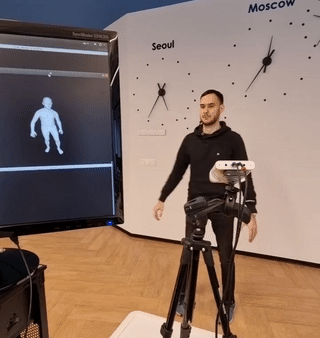

# Real-time RGBD-based Extended Body Pose Estimation

This repository is a real-time demo for our [**paper**](https://arxiv.org/abs/2103.03663) that was published at [WACV 2021](http://wacv2021.thecvf.com/home) conference
 
The output of our module is in [SMPL-X](https://smpl-x.is.tue.mpg.de) parametric body mesh model:
- RNN estimates body pose from joints detected by [Azure Kinect Body Tracking API](https://docs.microsoft.com/en-us/azure/kinect-dk/body-joints)
- For face (expression and jaw) and hand pose we crop from rgb image: 
  - for hand model we use [minimal-hand](https://github.com/CalciferZh/minimal-hand)
  - our face NN takes [media-pipe](https://google.github.io/mediapipe/solutions/face_mesh.html) keypoints as input

Combined system runs at 30 fps on a 2080ti GPU and 8 core @ 4GHz CPU.



# How to use

### Build
- Prereqs: your nvidia driver should support cuda 10.2, Windows or Mac are not supported.
- Clone repo:
  - `git clone https://github.com/rmbashirov/rgbd-kinect-pose.git`
  - `cd rgbd-kinect-pose`
  - `git submodule update --force --init --remote`
- Docker setup:
  - [Install docker engine](https://docs.docker.com/engine/install/ubuntu/)
  - [Install nvidia-docker](https://docs.nvidia.com/datacenter/cloud-native/container-toolkit/install-guide.html)
  - [Set](https://docs.nvidia.com/datacenter/cloud-native/container-toolkit/user-guide.html#daemon-configuration-file) nvidia your default runtime for docker
  - Make docker run without sudo: create docker group and add current user to it: 
    ```
    sudo groupadd docker
    sudo usermod -aG docker $USER
    ```
  - **reboot**
- Build docker image: [run](./docker) 2 cmds
- Attach your Azure Kinect camera
- Check your Azure Kinect camera is working inside Docker container:
  - Enter Docker container: `./run_local.sh` from `docker` dir
  - Then run `python -m pyk4a.viewer --vis_color --no_bt --no_depth` inside docker container


### Download data

- Download [our](https://drive.google.com/file/d/1Y6HzwJS9N9qWTNNYQdtNqf1FZKoZF-tg/view?usp=sharing) data archive `smplx_kinect_demo_data.tar.gz`
- Unzip: `mkdir /your/unpacked/dir`,  `tar -zxf smplx_kinect_demo_data.tar.gz -C /your/unpacked/dir`
- Download models for hand, see link in "Download models from here" line in our [fork](https://github.com/rmbashirov/minimal-hand), put to `/your/unpacked/dir/minimal_hand/model`    
- To download SMPL-X parametric body model go to [this](https://smpl-x.is.tue.mpg.de/) project website, register, go to the downloads section, download SMPL-X v1.1 model, put to `/your/unpacked/dir/pykinect/body_models/smplx`
- `/your/unpacked/dir` should look like [this](./readme/data_structure.txt)
- Set `data_dirpath` and `output_dirpath` variables in [config file](./src/config/server/renat.yaml):
  - `data_dirpath` is a path to `/your/unpacked/dir`
  - `output_dirpath` is used to check timings or to store result images
  - ensure these paths are visible inside docker container, set `VOLUMES` variable [here](https://github.com/rmbashirov/rgbd-kinect-pose/blob/b03818727b5101d572ebbc778d99d851bba2a40d/docker/run_local.sh#L5)

### Run

- Run demo: in `src` dir run `./run_server.sh`, the latter will enter docker container and will use [config file](./src/config/server/renat.yaml) where shape of the person is loaded from an external file: in our work we did not focus on person's shape estimation


# What else
Apart from our main body pose estimation contribution you can find this repository useful for:
- [minimal_pytorch_rasterizer](https://github.com/rmbashirov/minimal_pytorch_rasterizer) python package: CUDA non-differentiable mesh rasterization library for pytorch tensors with python bindings
- [pyk4a](https://github.com/rmbashirov/pyk4a) python package: real-time streaming from Azure Kinect camera, this package also works in our provided docker environment
- [multiprocessing_pipeline](https://github.com/rmbashirov/multiprocessing_pipeline) python package: set-up pipeline graph of python blocks running in parallel, see usage in [server.py](./src/server.py)
  

# Citation
If you find the project helpful, please consider citing us:
```
@inproceedings{bashirov2021real,
  title={Real-Time RGBD-Based Extended Body Pose Estimation},
  author={Bashirov, Renat and Ianina, Anastasia and Iskakov, Karim and Kononenko, Yevgeniy and Strizhkova, Valeriya and Lempitsky, Victor and Vakhitov, Alexander},
  booktitle={Proceedings of the IEEE/CVF Winter Conference on Applications of Computer Vision},
  pages={2807--2816},
  year={2021}
}
```

Non-commercial use only 
